# Теоретические модели вычислений
## ДЗ №1: Регулярные языки и конечные автоматы

### Задание 1. Построить конечный автомат, распознающий язык

1. L = {w ? {a, b, c}* | |w|c = 1}

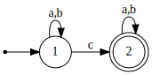

2. L = {w ? {a, b}* | |w|a ? 2, |w|b ? 2} 

Автомат получен с помощью прямого произведения автоматов. Исходные автоматы представлены снизу.

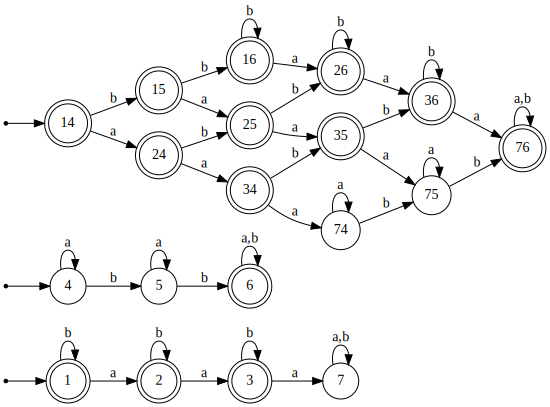

4. L = {w ? {a, b}* | ww = www} 

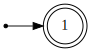

### Задание 2. Построить конечный автомат, используя прямое произведение 

1. L1 = {w ? {a, b}* | |w|a ? 2 ? |w|b ? 2}

2. L2 = {w ? {a, b}* | |w| ? 3 ? |w| нечётное}

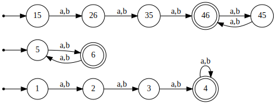

3. L3 = {w ? {a, b}? | |w|a чётно ? |w|b кратно трём}

4. L4 = ¬L3

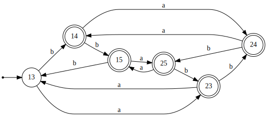

5. L5 = L2 \ L3

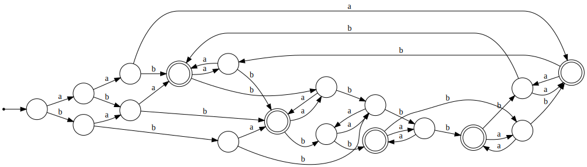

### Задание 3. Построить минимальный ДКА по регулярному выражению

1. (ab+aba)*a

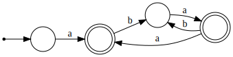

2. a(a(ab)*b)*(ab)*

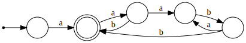

3. (a+(a+b)(a+b)b)*

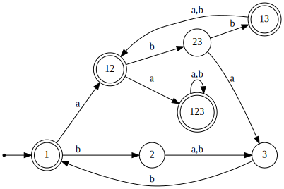

4. (b+c)((ab)*c+(ba)*)*

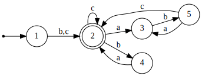

5. (a + b)+ (aa + bb + abab + baba)(a + b)+

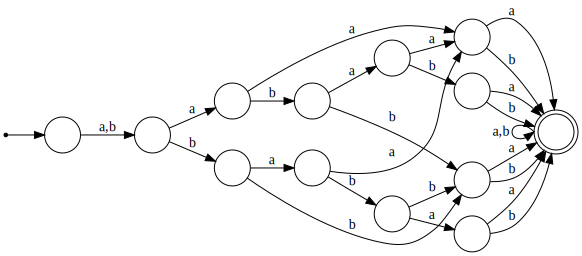

# Задание 4. Определить является ли язык регулярным или нет

1. L = {(aab)^n b(aba)^m | n ? 0, m ? 0}

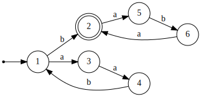

# Задание 5. Реализовать алгоритмы

Библиотека для взаимодействия с автоматами fa написана на Python. Примеры скриптов находятся в папке examples.