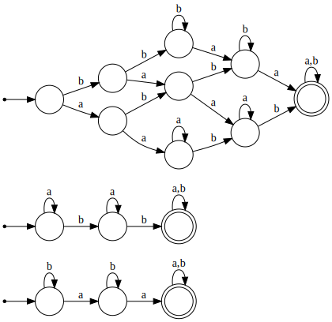
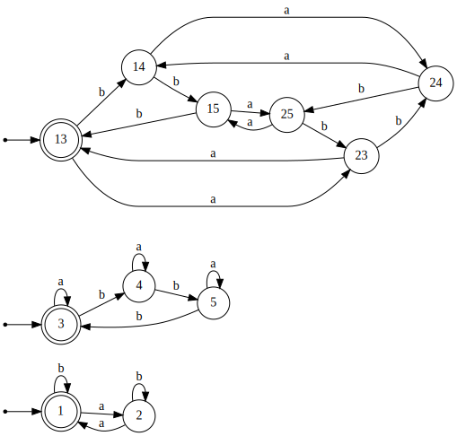

# Теоретические модели вычислений
## Дмитрий Поздеев, А-05-19
## ДЗ №1: Регулярные языки и конечные автоматы

### Задание 1. Построить конечный автомат, распознающий язык

Автомат получен с помощью прямого произведения автоматов. Исходные автоматы представлены снизу.

 

В языке необходимо запоминать количество букв, конечные автоматы такого не умеют.

### Задание 2. Построить конечный автомат, используя прямое произведение 

### Задание 3. Построить минимальный ДКА по регулярному выражению

# Задание 4. Определить является ли язык регулярным или нет

# Задание 5. Реализовать алгоритмы

В библиотеке fa были реализованы классы для взаимодействия с конечными автоматами. В папке examples находятся примеры построения ДКА по НКА, а также пересечения, объединения и разности языков.