# Прямое произведение
## Первый автомат
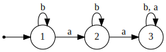
## Второй автомат
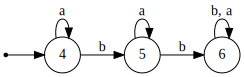
## Итерация 1
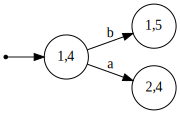
## Итерация 2
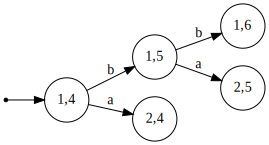
## Итерация 3
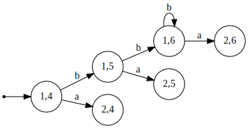
## Итерация 4
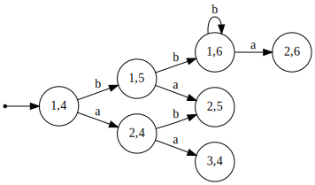
## Итерация 5
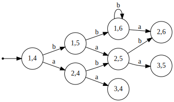
## Итерация 6
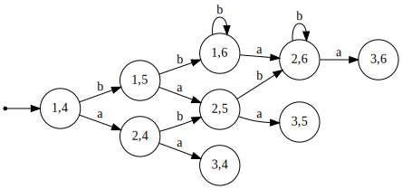
## Итерация 7
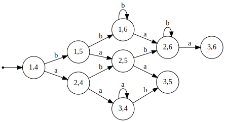
## Итерация 8
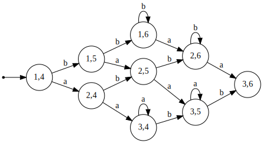
## Итерация 9
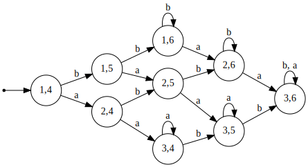
## Пересечение
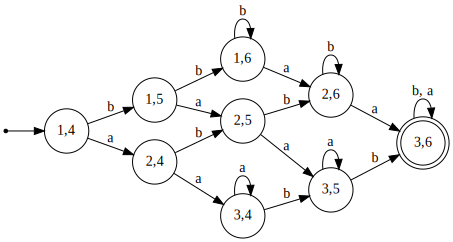
## Объединение
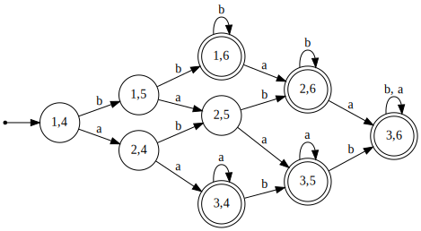
## Разность
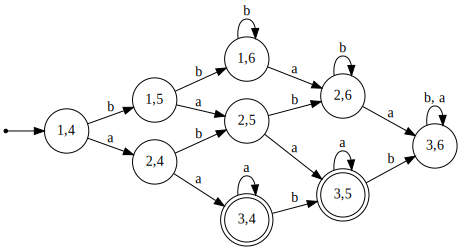
