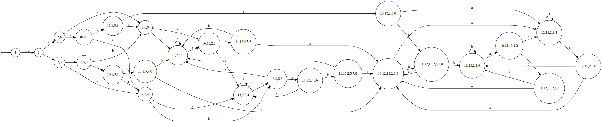

# НКА в ДКА
## Исходный автомат

## Итерация 1

## Итерация 2

## Итерация 3

## Итерация 4

## Итерация 5

## Итерация 6

## Итерация 7

## Итерация 8

## Итерация 9

## Итерация 10

## Итерация 11

## Итерация 12

## Итерация 13

## Итерация 14

## Итерация 15

## Итерация 16

## Итерация 17

## Итерация 18

## Итерация 19

## Итерация 20

## Итерация 21

## Итерация 22

## Итерация 23

## Итерация 24

## Итерация 25

## Итерация 26

## Результат

